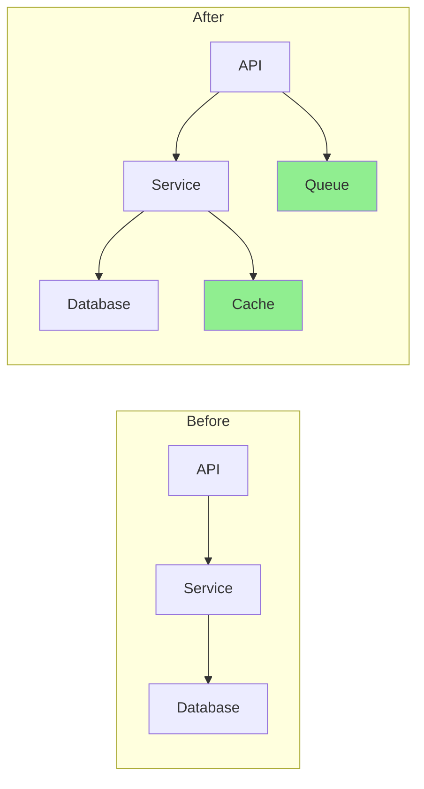
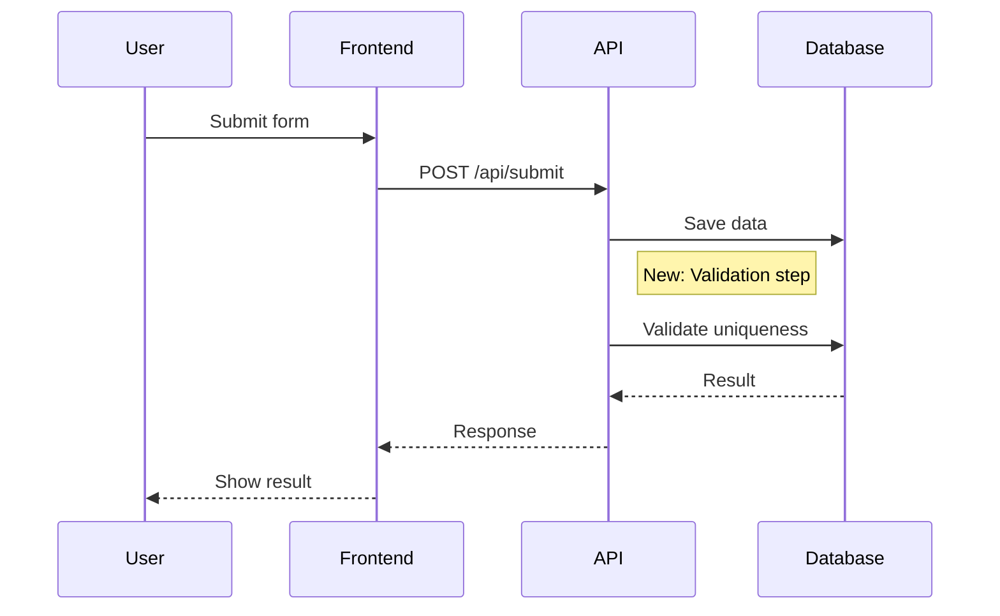

# Pull Request Best Practices

## PR Size Guidelines

### Optimal PR Size

**Recommended limits:**
- **Files changed**: < 20 files
- **Total changes**: < 400 lines (additions + deletions)
- **Review time**: 15-30 minutes maximum

**Why size matters:**
- Large PRs are harder to review
- More likely to introduce bugs
- Longer feedback cycles
- Reduced reviewer attention to detail

### When to Split a PR

Split when:
- Changes exceed 20 files or 400 lines
- Multiple unrelated features included
- Refactoring mixed with new features
- Different areas of codebase affected
- Can be deployed independently

### How to Split

```bash
# Strategy 1: Split by feature area
git checkout -b feature/part-1
git cherry-pick <commits-for-feature-1>
git push origin feature/part-1

git checkout -b feature/part-2
git cherry-pick <commits-for-feature-2>
git push origin feature/part-2

# Strategy 2: Split by type
# PR 1: Refactoring only
# PR 2: New features on top of refactor
# PR 3: Tests and documentation
```

## PR Description Structure

### Feature PR Template

```markdown
## Feature: [Feature Name]

### Summary
Brief description of what this feature does and why it's needed.

### User Story
As a [user type]
I want [feature]
So that [benefit]

### Changes Made
- Change 1
- Change 2
- Change 3

### Technical Implementation
Brief explanation of the technical approach.

### Testing
- [ ] Unit tests added
- [ ] Integration tests added
- [ ] Manual testing performed

### Screenshots/Demo
[Add screenshots or demo link for UI changes]

### Deployment Notes
Any special deployment considerations.

### Related Issues
Fixes #123
Related to #456
```

### Bug Fix PR Template

```markdown
## Bug Fix: [Brief Description]

### Issue
- **Reported in**: #[issue-number]
- **Severity**: Critical | High | Medium | Low
- **Affected versions**: X.Y.Z

### Root Cause
Explanation of what caused the bug.

### Solution
How the fix addresses the root cause.

### Testing
- [ ] Bug reproducible before fix
- [ ] Bug resolved after fix
- [ ] No regressions introduced
- [ ] Edge cases tested

### Verification Steps
1. Steps to reproduce original issue
2. Apply this fix
3. Verify issue is resolved
```

### Refactor PR Template

```markdown
## Refactoring: [Scope]

### Motivation
Why this refactoring is needed.

### Changes Made
- Restructured X
- Renamed Y to Z
- Extracted common logic into W

### Benefits
- Improved readability
- Reduced duplication
- Better maintainability

### Compatibility
- [ ] No breaking changes
- [ ] API remains unchanged
- [ ] Performance maintained or improved

### Metrics
| Metric | Before | After |
| ------ | ------ | ----- |
| Complexity | X | Y |
| Test Coverage | X% | Y% |
| Lines of Code | X | Y |
```

## PR Quality Metrics

### Risk Assessment Factors

**Size Risk:**
- Low: < 10 files, < 200 lines
- Medium: 10-20 files, 200-400 lines
- High: 20-50 files, 400-1000 lines
- Critical: > 50 files, > 1000 lines

**Complexity Risk:**
- Low: Simple changes, single area
- Medium: Multiple areas, some logic changes
- High: Architectural changes, complex algorithms
- Critical: Core system changes, breaking changes

**Test Coverage Risk:**
- Low: All changes covered, coverage increased
- Medium: Most changes covered, coverage maintained
- High: Some changes untested, coverage decreased
- Critical: Many changes untested, significant coverage drop

**Security Risk:**
- Low: No security-sensitive changes
- Medium: Auth/validation changes, config updates
- High: Crypto changes, privilege changes
- Critical: Core security system changes

**Dependency Risk:**
- Low: No dependency changes
- Medium: Patch/minor updates
- High: Major version updates
- Critical: New dependencies, breaking updates

### Review Checklist by Change Type

**Source Code Changes:**
- [ ] No code duplication
- [ ] Functions are focused and small (< 30 lines)
- [ ] Variable names are descriptive
- [ ] Error handling is comprehensive
- [ ] No performance bottlenecks
- [ ] Follows project coding standards
- [ ] No console.log or debug code

**Test Changes:**
- [ ] All new code is covered
- [ ] Tests are meaningful, not just for coverage
- [ ] Edge cases are tested
- [ ] Tests follow AAA pattern (Arrange, Act, Assert)
- [ ] No flaky tests introduced
- [ ] Test names are descriptive

**Configuration Changes:**
- [ ] No hardcoded values
- [ ] Environment variables documented
- [ ] Backwards compatibility maintained
- [ ] Security implications reviewed
- [ ] Default values are sensible
- [ ] No secrets in config files

**Documentation Changes:**
- [ ] Documentation is clear and accurate
- [ ] Examples provided where helpful
- [ ] API changes documented
- [ ] README updated if necessary
- [ ] Changelog updated

**Database Changes:**
- [ ] Migration is reversible
- [ ] No data loss risk
- [ ] Performance impact assessed
- [ ] Indexes added where needed
- [ ] Backwards compatible

**Security-Sensitive Changes:**
- [ ] No SQL injection vulnerabilities
- [ ] Input validation implemented
- [ ] Authentication/authorization correct
- [ ] No sensitive data in logs
- [ ] Dependencies are secure
- [ ] OWASP Top 10 considered

## Visual Aids for PRs

### Architecture Diagrams

Use Mermaid diagrams to show architectural changes:

```markdown
## Architecture Changes


\```

### Flow Diagrams

Show workflow or process changes:

```markdown
## User Flow Changes


\```

## PR Review Best Practices

### For PR Authors

**Before Creating PR:**
1. Self-review all changes
2. Run tests and linting locally
3. Update documentation
4. Write clear commit messages
5. Rebase on target branch
6. Check diff for debug code

**PR Description:**
1. Explain the "why" not just the "what"
2. Link to related issues/tickets
3. Add screenshots for UI changes
4. List breaking changes prominently
5. Include deployment notes
6. Add review focus areas

**During Review:**
1. Respond to comments within 24 hours
2. Address all feedback (or explain why not)
3. Keep discussions focused
4. Don't take feedback personally
5. Update PR description if scope changes
6. Re-request review after changes

### For PR Reviewers

**Review Focus:**
1. Understand the purpose first
2. Check logic and edge cases
3. Consider security implications
4. Evaluate performance impact
5. Verify test coverage
6. Assess maintainability

**Feedback Style:**
1. Be constructive and specific
2. Suggest improvements with examples
3. Distinguish between must-fix and nice-to-have
4. Praise good patterns and solutions
5. Ask questions to understand reasoning
6. Use GitHub review features (comment/request changes/approve)

**Review Priorities:**
1. **Critical**: Security, data loss, breaking changes
2. **High**: Logic errors, performance issues
3. **Medium**: Code quality, maintainability
4. **Low**: Style, naming, minor optimizations

## PR Merge Strategies

### When to Use Each Strategy

**Squash Merge:**
- Feature branches with multiple WIP commits
- Want clean, linear history
- One logical change per PR
- **Use for**: Most feature branches

**Merge Commit:**
- Want to preserve commit history
- Multiple logical units in PR
- Release branches
- **Use for**: Release merges, hotfixes

**Rebase Merge:**
- Want linear history with detailed commits
- Each commit is meaningful
- No merge conflicts
- **Use for**: Well-structured feature branches

## PR Lifecycle Management

### Draft PRs

Use draft PRs when:
- Work in progress, seeking early feedback
- Breaking down large features
- Experimenting with approaches
- CI checks needed before formal review

### Ready for Review

Before marking ready:
- [ ] All tests pass
- [ ] Code is self-reviewed
- [ ] Description is complete
- [ ] No WIP or debug code
- [ ] Documentation updated
- [ ] Breaking changes documented

### Post-Merge

After merging:
- [ ] Delete feature branch
- [ ] Verify deployment succeeded
- [ ] Monitor for issues
- [ ] Update related issues/tickets
- [ ] Communicate changes to team

## Common PR Mistakes to Avoid

1. **Too large**: Split into smaller, focused PRs
2. **Mixed concerns**: One PR = one logical change
3. **Poor description**: Explain the why and how
4. **No tests**: Every change needs tests
5. **Debug code**: Remove console.logs, debugger statements
6. **Merge conflicts**: Rebase regularly
7. **Ignored feedback**: Address all review comments
8. **Breaking changes without notice**: Document prominently
9. **No documentation**: Update docs with code
10. **Force pushing**: Avoid during active review

## Automation Opportunities

### Automated Checks

**PR Size Check:**
```yaml
# GitHub Action example
- name: Check PR size
  run: |
    FILES_CHANGED=$(git diff --name-only origin/${{ github.base_ref }}...HEAD | wc -l)
    if [ $FILES_CHANGED -gt 20 ]; then
      echo "::warning::PR has $FILES_CHANGED files. Consider splitting."
    fi
```

**Conventional Commits:**
```yaml
# Validate commit message format
- name: Check commit format
  run: |
    git log origin/${{ github.base_ref }}..HEAD --format=%s | \
    grep -Eq '^(feat|fix|docs|style|refactor|perf|test|build|ci|chore|revert)(\(.+\))?: .{1,50}'
```

**Test Coverage:**
```yaml
# Require coverage doesn't decrease
- name: Coverage check
  run: |
    coverage report --fail-under=80
```

### PR Templates

Use `.github/pull_request_template.md`:

```markdown
## Description
<!-- What does this PR do? Why is it needed? -->

## Type of Change
- [ ] Bug fix (non-breaking change which fixes an issue)
- [ ] New feature (non-breaking change which adds functionality)
- [ ] Breaking change (fix or feature that would cause existing functionality to not work as expected)
- [ ] Documentation update

## How Has This Been Tested?
<!-- Describe the tests you ran -->

## Checklist
- [ ] My code follows the project's style guidelines
- [ ] I have performed a self-review
- [ ] I have commented my code, particularly in hard-to-understand areas
- [ ] I have updated the documentation
- [ ] My changes generate no new warnings
- [ ] I have added tests that prove my fix is effective or that my feature works
- [ ] New and existing unit tests pass locally
- [ ] Any dependent changes have been merged and published
```

## References

- [Google's Code Review Guidelines](https://google.github.io/eng-practices/review/)
- [GitHub PR Best Practices](https://docs.github.com/en/pull-requests/collaborating-with-pull-requests)
- [Conventional Commits](https://www.conventionalcommits.org/)
- [Effective Pull Requests](https://www.pullrequest.com/blog/writing-a-great-pull-request-description/)
